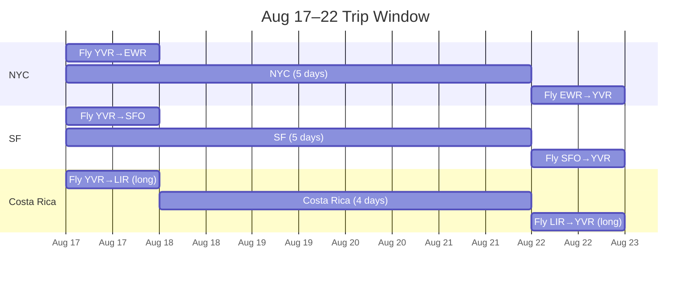
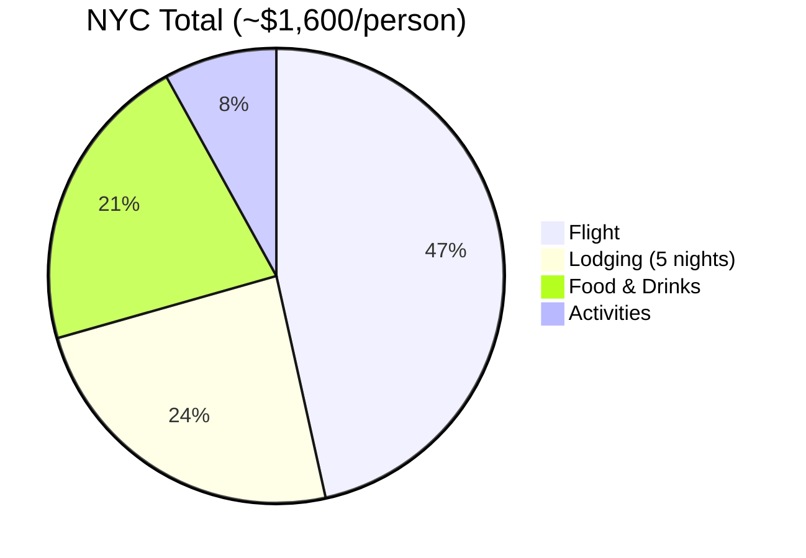
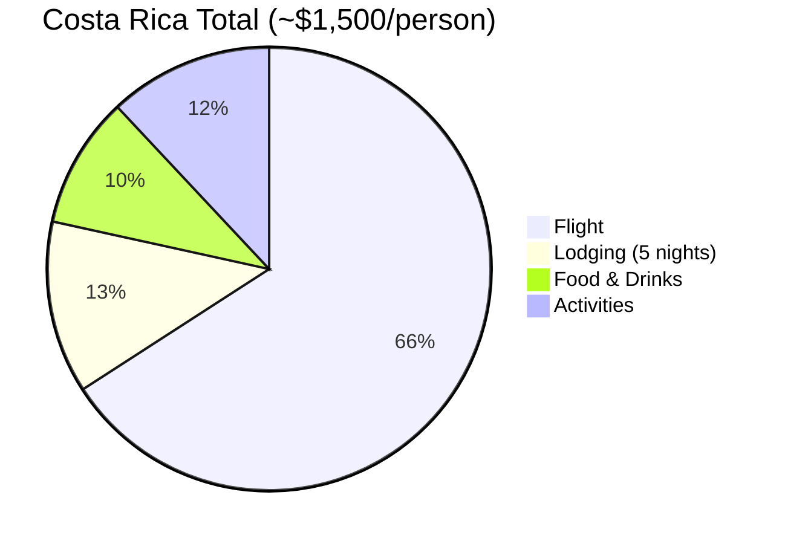
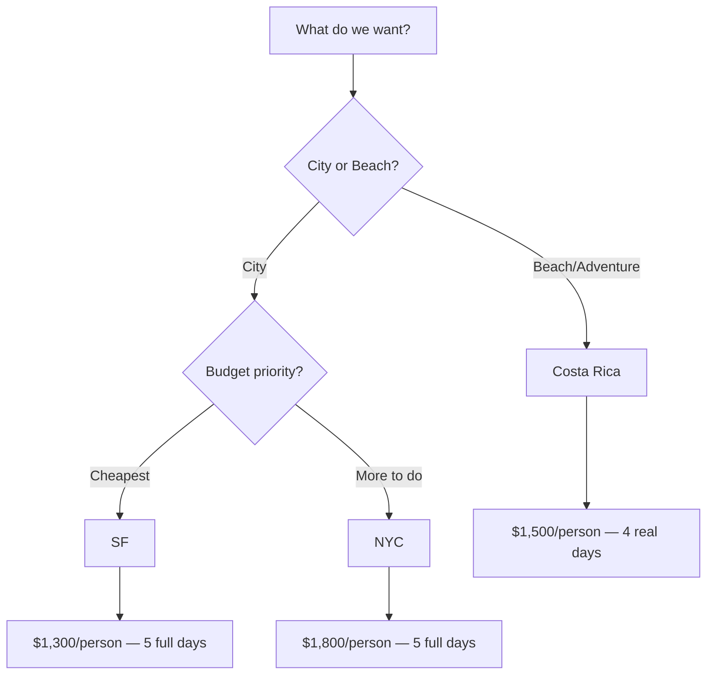

# Trip Options — Aug 17–22

Flying from Vancouver. Back by evening of Aug 22.

---

## New York City

**Flight:** $728–$1,018
**Lodging:** $80–$100/person/night (split Airbnb in Jersey City, PATH train to Manhattan)
**Total per person:** ~$1,400–$1,800

- Bars and food in Brooklyn (Williamsburg, Bushwick)
- Comedy Cellar, Broadway show
- Rooftop bars, LES nightlife
- Central Park, High Line, SoHo

---

## San Francisco

**Flight:** $613–$778
**Lodging:** $70–$105/person/night (split Airbnb in the Mission)
**Total per person:** ~$1,100–$1,500

- Golden Gate Bridge bike ride
- Mission District — burritos, bars
- Dolores Park
- Day trip to Muir Woods or wine country (Sonoma)
- North Beach, Chinatown

---

## Costa Rica

**Flight:** $991–$1,198
**Lodging:** $30–$55/person/night (split Airbnb or hostel)
**Total per person:** ~$1,300–$1,700

- Surfing (Tamarindo or Nosara)
- Beach days
- Zip-lining, waterfall hikes
- Cheap food and drinks
- Downside: 8–10hr travel each way, so really only 4 days on the ground

---

## Comparison

| | NYC | SF | Costa Rica |
|--|-----|----|----|
| Flight | $728–$1,018 | $613–$778 | $991–$1,198 |
| Lodging (each) | $80–$100/night | $70–$105/night | $30–$55/night |
| Travel time | 5.5hr | 2.5hr | 8–10hr |
| Total/person | $1,400–$1,800 | $1,100–$1,500 | $1,300–$1,700 |

Book soon — 2 weeks out.

---

## Timeline

## Cost Breakdown

## Decision Flow

